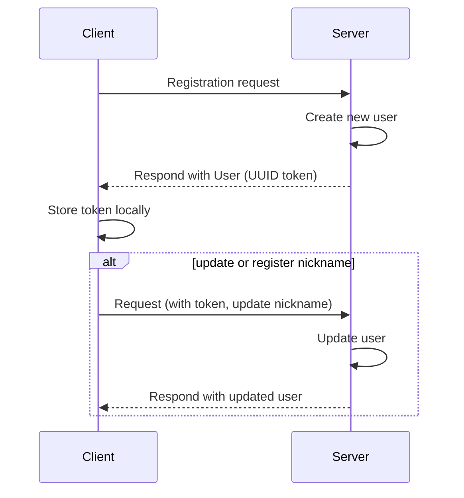

# Tako

## Prerequisites

You must have a recent version of Elixir and Erlang/OTP installed.

To start your Phoenix server:

  * Run `mix setup` to install and setup dependencies
  * Start Phoenix endpoint with `mix phx.server` or inside IEx with `iex -S mix phx.server`

You must have an instance of **PostgreSQL** running on your machine. The default configuration is:

  * Username: `postgres`
  * Password: `postgres`
  * Database: `tako_dev`

Ready to run in production? Please [check our deployment guides](https://hexdocs.pm/phoenix/deployment.html).

## Learn more

  * Official website: https://www.phoenixframework.org/
  * Guides: https://hexdocs.pm/phoenix/overview.html
  * Docs: https://hexdocs.pm/phoenix
  * Forum: https://elixirforum.com/c/phoenix-forum
  * Source: https://github.com/phoenixframework/phoenix

## Useful functions

Send a message payload to a specific user.

```elixir
TakoWeb.Endpoint.broadcast("notifications:scans", "msg", %{user_id: "681adb8b-be3d-4fca-8858-2827609d9b22", message: "Testiiing"})
```

## Request authorization

All API requests must include a secret bearer token configured through the `HOLOQUEST_API_TOKEN` environment variable.

## Client registration

At the moment, clients register in the system by making a call to the HTTP API.

`POST localhost:4000/api/json/accounts/users/`

The content type must be `application/vnd.api+json`.

The response will include a JSON-API compliant response with the user's UUID.

```json
{
  "data": {
    "id": "681adb8b-be3d-4fca-8858-2827609d9b22",
    "type": "user"
  }
}
```

This UUID is used to authenticate the client and must be stored by the client.



## Client authentication

The client authenticates using its own unique UUID and is sent in the `connect` message to the socket. The user must be registered within the system to be authenticated.

## Realtime features

Tako uses Phoenix Channels for client bidirectional messaging.

During local development, the server listens at `ws://localhost:4000/socket`.

You can find defined channels in the `channels` directory.

To learn more about Phoenix channels and Presence, check out the [Phoenix docs](https://hexdocs.pm/phoenix/channels.html).
